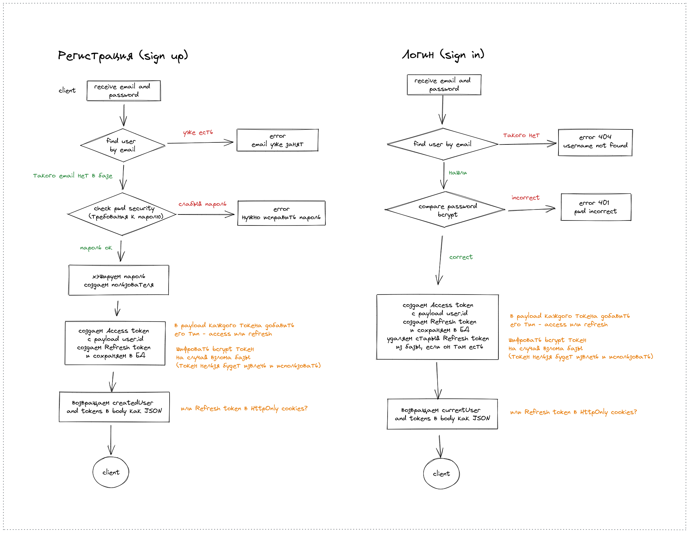
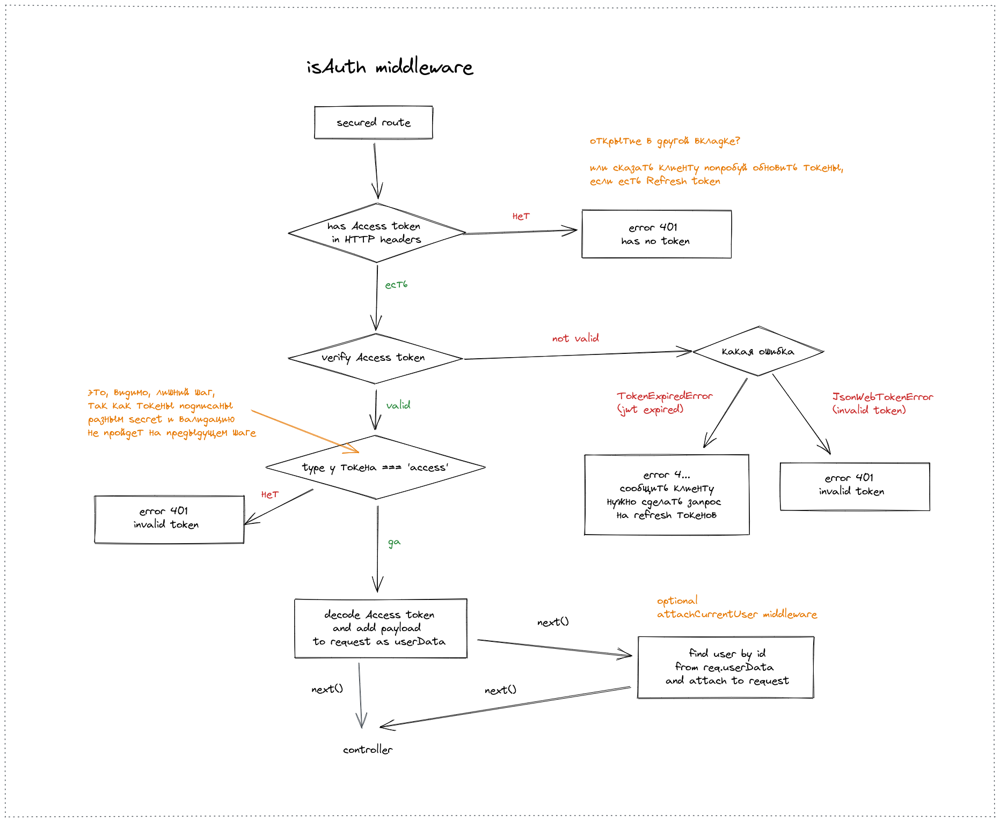
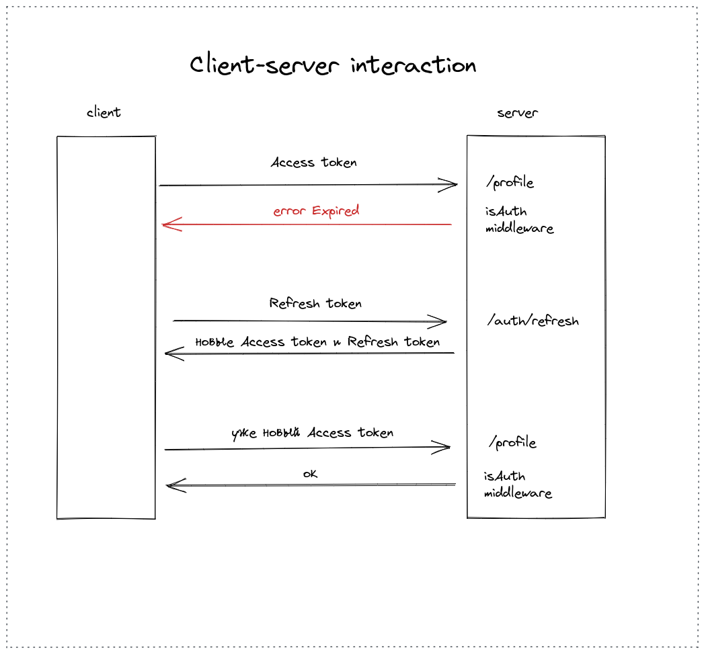
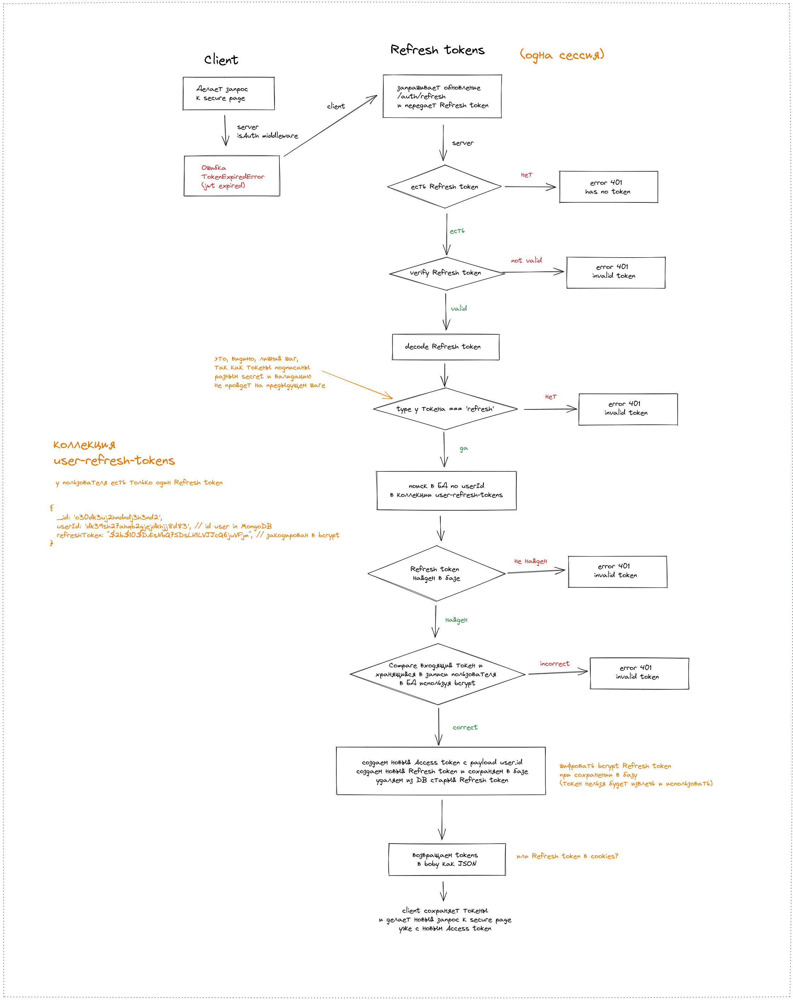
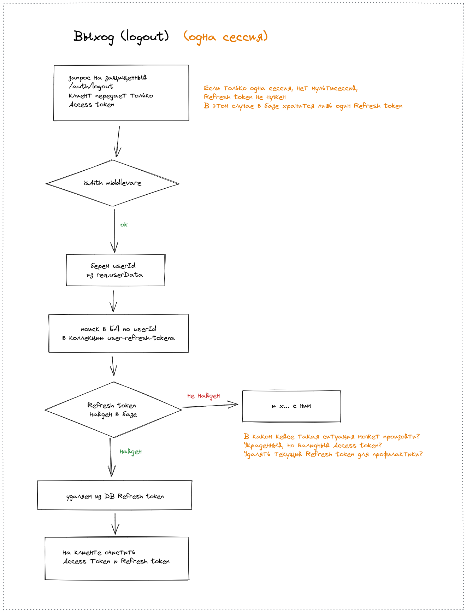

# Аутентификация/авторизация пользователей, server

REST API, серверная часть, более защищенная аутентификация/авторизация, используется два токена `Access token` и `Refresh token`, инвалидация токенов

Front-end, клиент на Angular, *будет* здесь `auth-secure-client`

## Техническое задание

* Express, база данных MongoDB, ODM Mongoose
* REST API, JSON
* Регистрация пользователя (sign up), авторизация (sign in, login), выход (logout)
* Без подтверждения email (данный функционал пока не реализован)
* Пароли при сохранении в БД хэшируются (`bcrypt`)
* Используется JWT, два токена `Access token` и `Refresh token`
* `Access token` с клиента передается в headers, `Refresh token` в cookies/headers/body
* `Access token` имеет короткий срок жизни (например, 1 час), `Refresh token` гораздо больший (например, 7 дней)
* Клиент, в случае получения ответа от сервера о том, что  `Access token` истек, делает запрос на `/auth/refresh` для обновления обоих токенов, далее делает запрос к нужному роуту уже с новым `Access token`
* `Refresh token` хранится в базе, что позволяет сделать инвалидацию (систему отзыва токенов), в `payload` токена добавлен `userId`
* Доступ к профилю только авторизованному пользователю, только к своему профилю
* Обработка ошибок
* Файл `.env` добавлен в git в учебных целях, в production, конечно, так делать нельзя

Схема аутентификации/авторизации - на рисунках:

### API docs

* `GET` `/` - главная страница

Авторизация:

* `POST` `/auth/signup` - регистрация пользователя
* `POST` `/auth/login/` - авторизация пользователя
* `POST` `/auth/logout` - выход из системы, secure page
* `POST` `/auth/refresh/` - обновление обоих токенов

Not implemented:

* `POST` `/auth/remove` - удаление пользователя, secure page
* `GET` `/profile` - профиль пользователя, secure page
* `GET` `/users` - получить всех пользователей

## TODO

* Подтверждение email (confirm)
* Сделать удаление пользователя (можно удалить свой аккаунт)
* Проверить разные вкладки, мультисессии (одновременный вход с разных устройств)
* Добавить строгую валидацию входящих данных (email, password) (`express-validator` или `joi`)
* Добавить `helmet`, `cors` (безопасность)

## Feedback

Писать на почту - dmitriy.tka4@gmail.com
